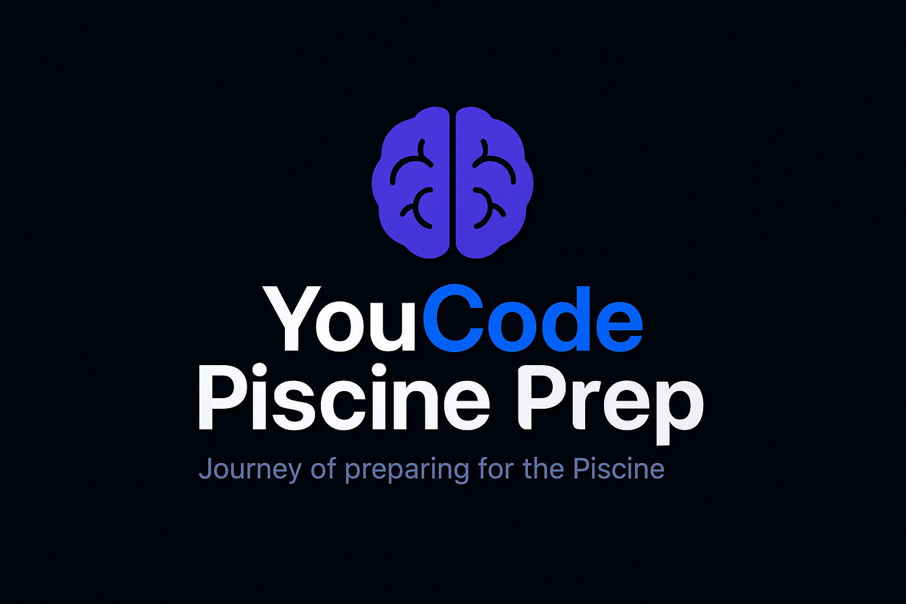

# YouCode Piscine Prep 🚀

Welcome to the **YouCode Piscine Prep** roadmap – your structured guide for preparing for the **YouCode SAS**. This plan helps you build strong C programming fundamentals through daily tasks and hands-on mini-projects.

> **Journey of preparing for the Piscine.**  
> From basics to mini-projects to mastering C – step by step.

---

## 📅 Roadmap Progress

| **Day** | **Topics**                               | **Goals**                                                          | **Status**    |
|:-------:|-----------------------------------------|--------------------------------------------------------------------|:-------------:|
| **00**  | Basics                                  | Data types, variables, basic I/O, simple math                      | ✅ **Done**   |
| **01**  | Conditionals                            | `if`, `else`, `else if`, `switch`, nested conditionals            | ✅ **Done**   |
| **02**  | Loops                                  | `for`, `while`, `do-while`, nested loops                          | ✅ **Done**   |
| **03**  | Functions                              | Defining and using functions, parameter passing                    | ✅ **Done**   |
| **04**  | Recursion                        | Concept of recursion, base case, recursive calls, simple examples (factorial, fibonacci, sum of array) | ⬜ **Pending** |
| **05**  | Arrays                                 | 1D/2D arrays, array manipulation                                   | ⬜ **Pending** |
| **06**  | Mini Project: Student Management System | Build a CLI-based student record system using arrays               | ⬜ **Pending** |
| **07**  | Pointers                               | Pointer arithmetic, pointers with arrays                           | ⬜ **Pending** |
| **08**  | String Manipulation                    | Handling C-strings, `str` library functions, memory safety         | ⬜ **Pending** |
| **09**  | Basic Algorithms                       | Sorting (bubble, selection), searching (linear, binary)            | ⬜ **Pending** |
| **10**  | Command Line Arguments                 | `argc`, `argv`, simple CLI input parsing                           | ⬜ **Pending** |
| **11**  | Dynamic Memory Allocation              | `malloc`, `calloc`, `free`, memory leaks, intro to `valgrind`      | ⬜ **Pending** |
| **12**  | Debugging & Compilation                | `gdb` basics, compiler flags (`-Wall -Wextra -Werror`)             | ⬜ **Pending** |
| **13**  | User-Defined Structures                | `struct`, `typedef`, building custom data types                    | ⬜ **Pending** |
| **14**  | Mini Project: Library Book Management  | Manage books (add, delete, search) using `struct`                 | ⬜ **Pending** |
| **15**  | File Handling                         | `fopen`, `fwrite`, `fscanf`, reading/writing data files            | ⬜ **Pending** |
| **16**  | Mini Project: Contact Directory        | CLI app to save/retrieve contacts using files + structs           | ⬜ **Pending** |
| **17**  | Modular Programming & Headers          | Organize code in multiple files, use header files                  | ⬜ **Pending** |
| **18**  | Project & Makefile                    | Build a full project with a proper `Makefile`                      | ⬜ **Pending** |
| **19**  | Final Mini Project                    | ATM System or Simple Inventory Manager (arrays, structs, files)    | ⬜ **Pending** |

---

## 💡 Why This Roadmap?

- Structured progression from **fundamentals to advanced**.
- Hands-on **mini-projects** after each major concept.
- Specifically designed for **YouCode candidates**.

---

> **Code daily. Build projects. Master C.**
